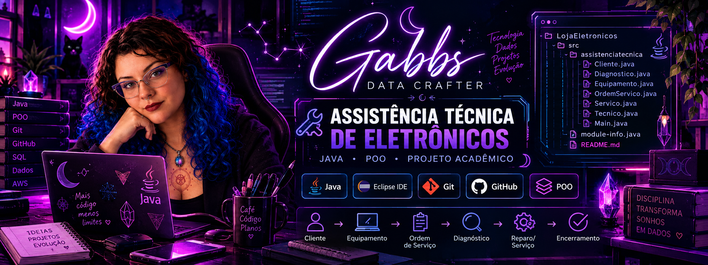

<p align="center">
  
</p>

<h1 align="center">Assistência Técnica de Eletrônicos</h1>

<p align="center">
  Projeto desenvolvido em Java para praticar Programação Orientada a Objetos.
</p>

---

## Sobre o projeto

Este projeto foi desenvolvido durante meus estudos em **Desenvolvimento de Sistemas**, com o objetivo de colocar em prática conceitos de **Programação Orientada a Objetos (POO)** utilizando Java.

O sistema simula o fluxo básico de uma assistência técnica de eletrônicos, desde o cadastro do cliente e do equipamento até o diagnóstico, orçamento, reparo e encerramento da ordem de serviço.

A proposta foi desenvolver um sistema capaz de representar o atendimento realizado por uma assistência técnica, organizando as principais entidades e responsabilidades envolvidas nesse processo.

---

## Funcionalidades

O sistema permite representar:

- cadastro de clientes;
- cadastro de equipamentos;
- abertura de ordens de serviço;
- registro de diagnóstico técnico;
- definição dos serviços necessários;
- geração de orçamento;
- registro da realização do reparo;
- atualização do status da ordem de serviço;
- encerramento da ordem de serviço.

---

## Estrutura do sistema

O projeto foi organizado utilizando classes que representam as principais entidades da aplicação:

### Cliente
Armazena os dados do cliente e seus equipamentos.

### Equipamento
Representa o equipamento enviado para assistência e mantém sua relação com o cliente e com as ordens de serviço.

### Diagnostico
Armazena as informações obtidas durante a análise técnica do equipamento.

### Servico
Representa um serviço necessário ou realizado durante o reparo.

### OrdemServico
Centraliza o fluxo do atendimento, incluindo diagnóstico, orçamento, serviços e status da ordem.

### Tecnico
Representa o profissional responsável pelo diagnóstico e execução dos procedimentos técnicos.

### Main
Responsável por executar uma simulação do funcionamento do sistema.

---

## Conceitos praticados

Durante o desenvolvimento foram utilizados conceitos de Programação Orientada a Objetos, como:

- classes e objetos;
- atributos e métodos;
- construtores;
- encapsulamento;
- getters e setters;
- associação entre objetos;
- `ArrayList`;
- organização e separação de responsabilidades.

---

## Tecnologias utilizadas

- Java
- Eclipse IDE
- Git
- GitHub

---

## Estrutura de pastas

```text
LojaEletronicos/
├── assets/
│   └── banner-gabbs-data-crafter.png
├── src/
│   ├── assistenciatecnica/
│   │   ├── Cliente.java
│   │   ├── Diagnostico.java
│   │   ├── Equipamento.java
│   │   ├── Main.java
│   │   ├── OrdemServico.java
│   │   ├── Servico.java
│   │   └── Tecnico.java
│   └── module-info.java
└── .gitignore

```


\## Contexto


Este projeto faz parte da minha formação em Desenvolvimento de Sistemas e representa uma das minhas primeiras experiências desenvolvendo um sistema em Java utilizando Programação Orientada a Objetos.


Além da implementação, o projeto também foi utilizado para praticar modelagem de classes, organização do código e versionamento com Git e GitHub.


\---


Desenvolvido por \*\*Gabriela Oliveira\*\* durante meus estudos em Desenvolvimento de Sistemas.

